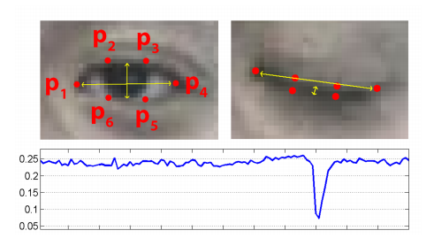

# real-time eye blink detection using facial landmarks \(paper\)

## The Objectives of a paper

SVM classifier detects eye blinks as a pattern of EAR values

 [real-time eye blink detection using facial landmarks.pdf](file:///C:/Users/User/OneDrive/Desktop/opencv/real-time%20eye%20blink%20detection%20using%20facial%20landmarks.pdf)


### What is EAR\(Summary\)?

The eye aspect ratio \(EAR\) between height and width of the eye is computed.




### EXPERIMENT

For observation, i insert code to see EAR history 

```text
arr.append(ear)
...
plt.plot(arr)
plt.show()
```


we can know that if EAR is smaller than around 0.3~0.28, then blinking.  --&gt; EYE\_AR\_THRESH = 0.3


## Additional

_If you want more detailed study go to_ 

> [https://www.pyimagesearch.com/2017/04/24/eye-blink-detection-opencv-python-dlib/](https://www.pyimagesearch.com/2017/04/24/eye-blink-detection-opencv-python-dlib/)

If you want source code

> [https://github.com/sunjungAn/Opencv\_practice/blob/master/Facial%20landmarks%20with%20dlib%2C%20OpenCV%2C%20and%20Python/detect\_blinks.py](https://github.com/sunjungAn/Opencv_practice/blob/master/Facial%20landmarks%20with%20dlib%2C%20OpenCV%2C%20and%20Python/detect_blinks.py)


 


