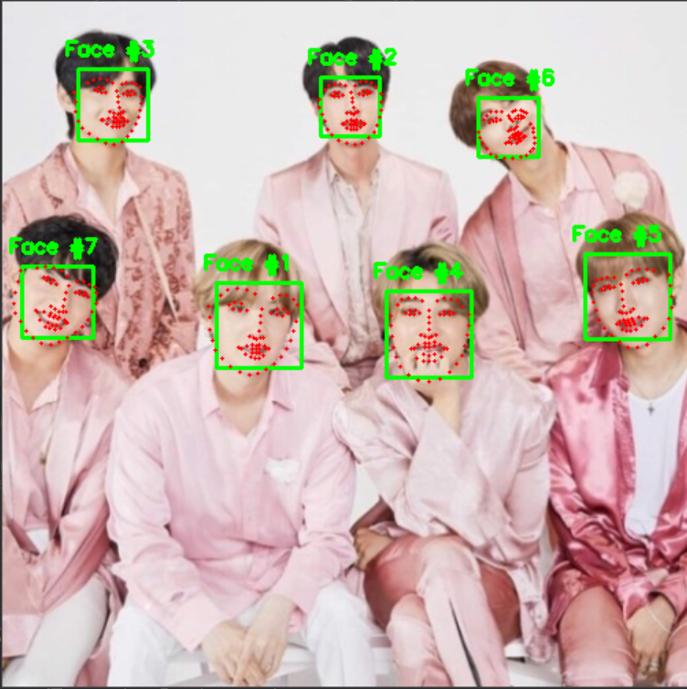

# Real\_time facial-landmarks-dlib-opencv-python

## The Objectives of a project

Using a webcam, we will get real-time video. so, I will detect facial-landmakrs

 Linear SVM object detector 

[https://www.pyimagesearch.com/2017/04/03/facial-landmarks-dlib-opencv-python/](https://www.pyimagesearch.com/2017/04/03/facial-landmarks-dlib-opencv-python/)

[https://www.pyimagesearch.com/2014/11/10/histogram-oriented-gradients-object-detection/](https://www.pyimagesearch.com/2014/11/10/histogram-oriented-gradients-object-detection/)

### Result 

